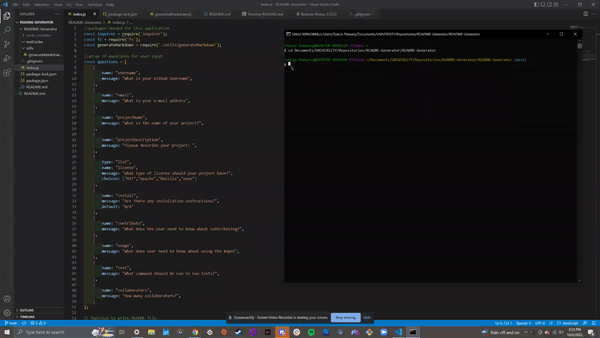

# README-Generator

## Table of Contents
* [Description](#Description)
* [Installation](#Installation)
* [Usage](#Usage)
* [License](#License)
* [Contribute](#Contribute)
* [Questions](#Questions)

## Description

This application prompts the user (via Windows Command Processor/Terminal) a series of questions, for which the respective answers will be used as parameters for generating a README.md file. Developing this application used the following technologies: Nodejs, Inquirer package, and the file system package. My biggest motivation for developing this application was in fact to learn more of the latter two aforementioned technologies. Another concept I explored during the development of this application was modularization. Namely, this occurs in the included ./utils/generateMarkdown.js file.

## Demo

---

## Installation

Installation instructions: `npm i`

## Usage

In Windows Command Processor/Terminal, run `node index.js`

## License

This project uses the MIT
https://opensource.org/licenses/MIT

---

## Questions

If you have any follow up questions, feel free to reach out at toacinp@gmail.com  
GitHub: https://www.github.com/Toacin